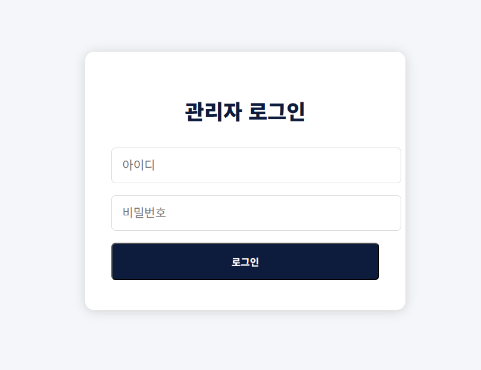
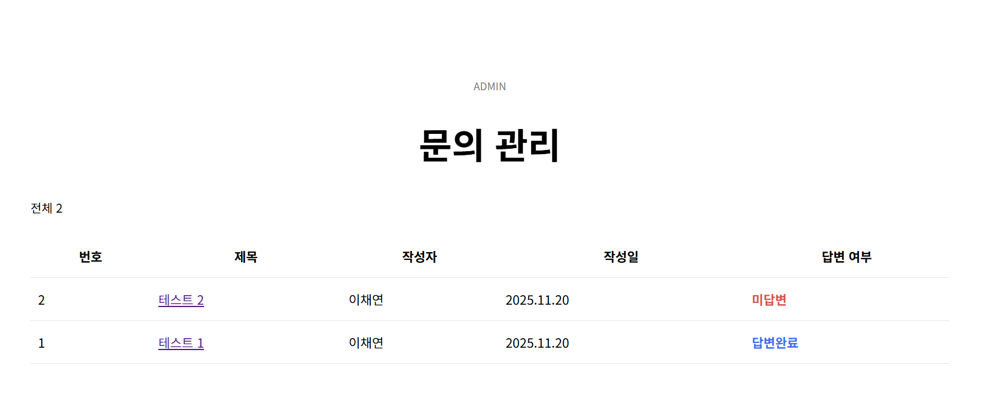
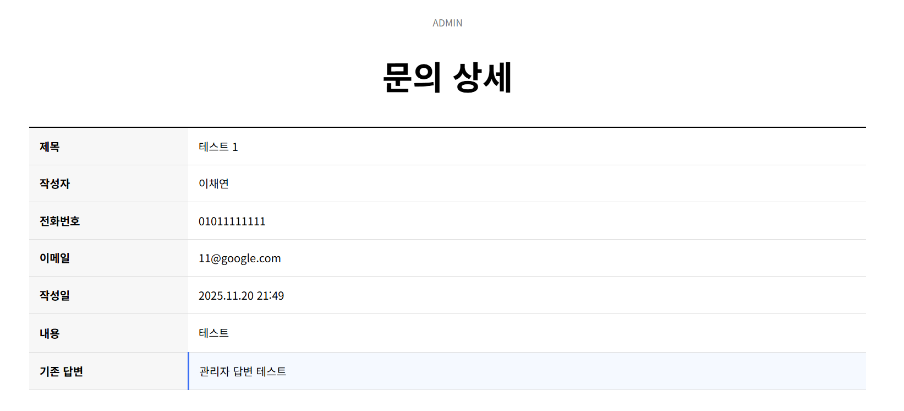
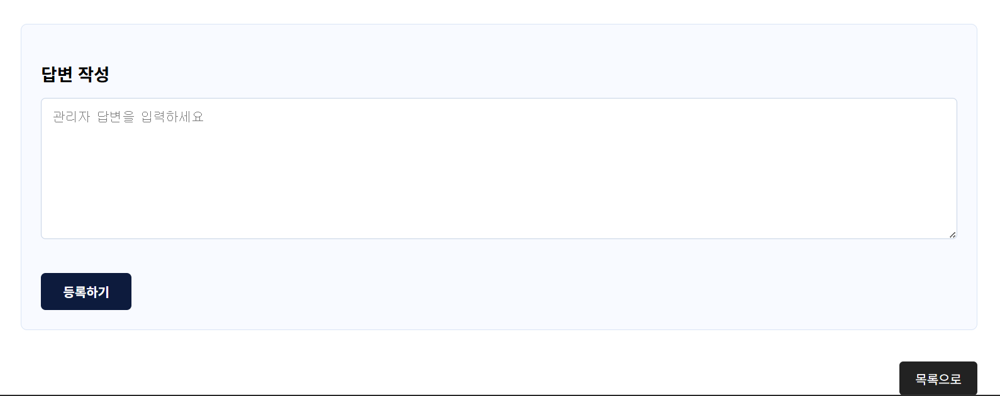

# ☀️ Sunlighting Company Website

> 조명 시공 전문 업체 “㈜썬라이팅(선라이팅)”의 공식 웹사이트 개발 프로젝트입니다.  
> Java 기반 웹 애플리케이션과 Railway MySQL을 연동하여 실제 기업용 문의 게시판 및 관리자 기능까지 구현했습니다.

---

## 📌 프로젝트 소개 (Description)

Sunlighting 회사 사이트는 다음과 같은 기능을 제공하는 **기업 홍보 및 고객 문의 관리용 웹사이트**입니다.

- 회사 소개(홈)  
- 시공사례(포트폴리오)  
- 문의 게시판(Q&A)  
- 관리자 전용 답변 기능  

프론트 영역(화면)은 Java(JSP) 기반 서버 사이드 렌더링으로 구성되어 있으며,  
백엔드는 Railway MySQL과 연동되어 **문의글·답변 데이터를 DB에 저장**합니다.

👉 **배포 링크:** https://sunlighting.onrender.com/

---

## 🛠️ 기술 스택 (Tech Stack)

### 🎨 Frontend

- HTML  
- CSS  
- JavaScript  
- JSP (서버 사이드 렌더링)

### ⚙️ Backend

- Java (JDK, Maven 프로젝트)  
- JSP / Servlet (Tomcat 기반)  
- JDBC를 통한 MySQL 연동  
- Controller / Service / DAO 계층 분리  
- 관리자 인증 및 문의 답변 처리 로직

### 🗄 Database

- **MySQL (Railway Cloud Database)**  
- 문의 게시판(Q&A)의 글, 작성자, 작성일, 상태(미답변/답변완료), 관리자 답변 등을 저장

### 🚀 Deployment

- **Render**
  - Web Service: Java 애플리케이션 배포 (포트 8080 기준)
- **Railway**
  - MySQL Cloud Database 인스턴스 사용

---

## ✨ 주요 기능 (Features)

### 🏠 메인 페이지 (Home)

- 회사명, 슬라이드 배너, 주요 조명 카테고리(경관 조명, 드롭형 조명, 라인 조명, 외벽 연출 조명, 조명 조형물, 크리스마스 트리) 노출  
- “회사 소개”, “경관 조명 전문가”, “안전 시공”, “맞춤형 디자인” 등 핵심 문구 제공  
- 하단에 상호, 사업자등록번호, 주소, 연락처, 이메일 정보 표기

### 🖼 포트폴리오 (시공사례)

- `/portfolio`  
- 강남 데이터센터, 강원랜드 하이원 리조트, 과천 계룡건설, 금성백조, 대전 현대아울렛 등  
  여러 시공 사례명을 리스트 형식으로 제공  
- 실제 이미지 슬롯도 포함되어 있어 추후 사진 교체/추가가 용이한 구조

### 📨 문의하기 (Contact / Q&A 게시판)

- `/contact`  
- 문의 게시판 리스트 페이지
  - “문의하기” 안내 문구
  - 전체 글 개수 표기
  - 문의 목록: 번호, 제목, 작성자, 작성일, 상태(예: `미답변`, `답변 완료`)
  - “문의 작성” 버튼을 통해 작성 페이지로 이동
- 문의글 작성 시 DB에 저장되며, 목록에 노출

### 🔐 관리자 페이지 (Admin)

* 관리자 로그인 페이지를 통해 관리자 계정으로 접속
* 사용자 문의 목록을 조회 가능
* 각 문의 상세 페이지에서 **관리자 답변 등록 기능** 제공
* 답변이 등록되면 상태가 “답변 완료”로 변경되고, 사용자도 답변 확인 가능

---

#### 🧩 관리자 로그인



---

#### 📋 문의 관리



---

#### 📝 문의 답변





---

## 📁 프로젝트 구조 (Project Structure)

> 실제 레포지토리 구조 기준으로 정리했습니다.

```text
sunlighting/
├── .mvn/
│   └── wrapper/              # Maven Wrapper 설정
├── src/
│   └── main/
│       ├── java/             # Java 소스 (controller, service, dao 등)
│       ├── resources/        # 설정 파일, 정적 리소스 (필요 시)
│       └── webapp/
│           └── WEB-INF/
│               └── views/    # JSP 뷰 파일들
├── Dockerfile                # Docker 배포 설정
├── mvnw, mvnw.cmd            # Maven Wrapper 실행 스크립트
├── pom.xml                   # Maven 의존성 및 빌드 설정
└── README.md
````

---

## 🔐 백엔드 – Railway MySQL 연동

애플리케이션은 Railway에서 제공하는 MySQL 인스턴스와 연동됩니다.
DB 접속 정보는 환경 변수로 관리합니다.

### 환경 변수 예시

```env
DB_HOST=containers-us-west-###.railway.app
DB_PORT=3306
DB_USER=root
DB_PASSWORD=******
DB_NAME=railway
```

### Java (JDBC) 연결 코드 예시

```java
Class.forName("com.mysql.cj.jdbc.Driver");

Connection conn = DriverManager.getConnection(
    "jdbc:mysql://" + host + ":" + port + "/" + dbName,
    user,
    password
);
```

---

## 🚀 배포 방식 (Deployment)

### 🌐 Render – Web Service

* 빌드: Maven으로 Jar/WAR 빌드
* Render에서 **Web Service**로 등록
* Start Command: (설정한 실행 방법에 따라) 예:

  * `java -jar target/sunlighting-0.0.1-SNAPSHOT.jar`
* 환경 변수에 Railway MySQL 접속 정보 설정
* 배포 후 도메인: `https://sunlighting.onrender.com`

### 🗄 Railway – MySQL

* Railway 대시보드에서 MySQL 인스턴스 생성
* 호스트/포트/유저/패스워드/DB명 정보를 Render 환경 변수에 등록
* 문의글/답변/관리자 정보 등은 해당 DB에 저장

---

## 🔧 설치 및 실행 방법 (Installation)

### 1️⃣ 저장소 클론

```bash
git clone https://github.com/dangerouswomanlee/sunlighting.git
cd sunlighting
```

### 2️⃣ 환경 변수 설정

아래와 같이 `.env` 또는 Render 환경 변수에 DB 정보를 설정합니다.

```env
DB_HOST=...
DB_PORT=3306
DB_USER=root
DB_PASSWORD=...
DB_NAME=railway
```

또는 `application.properties` / `application.yml`에 직접 설정했다면
그 설정 값에 맞게 수정합니다.

### 3️⃣ 로컬 빌드 및 실행

Maven Wrapper 사용 시:

```bash
./mvnw clean package
```

이후 IDE(Tomcat) 또는 `java -jar` 방식으로 실행합니다.

서버가 실행되면 브라우저에서 아래 주소로 접속합니다.

* [http://localhost:8080/](http://localhost:8080/)

---

## 🧩 향후 개선 계획 (Future Work)

* 관리자 페이지 UI 개선 (검색/필터/페이지네이션 추가)
* 문의 등록 시 이메일/문자 알림 연동
* 시공사례 상세 페이지(사진 + 설명) 구현
* 반응형 웹 디자인 강화(모바일 최적화)
* 관리자 권한/계정 관리 기능 분리(여러 관리자 계정 지원)


